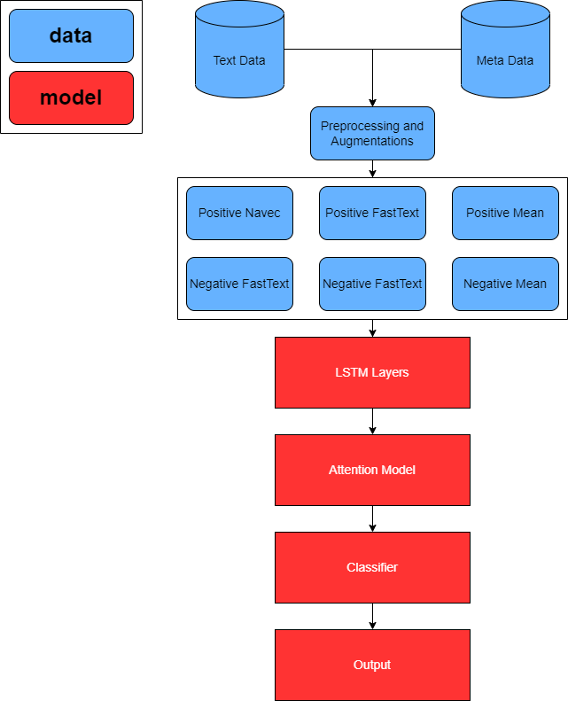

# hh_compete

## Overview (copied from competition description)
Компании HeadHunter и DreamJob работают в коллаборации, вместе упрощают и делают удобным поиск работы для каждого. Сейчас на сайте hh.ru можно прочитать отзывы о работодателе, которые собирает сервис dreamjob.ru. Публиковать или нет отзыв решают модераторы, есть 8 причин отклонения отзыва. Вам нужно создать модель, определяющую, будет ли опубликован отзыв и причину отклонения модерации.

## Links
1. [Competition](https://boosters.pro/championship/HeadHunter/overview)
2. [Trello](https://trello.com/b/J68m9WBK/hhcompete)

## TODO
- [x] EDA
- [x] Baseline
- [x] LSTM Network
- [x] RuBert
- [x] LSTM with Attention
- [x] Multilable
- [x] Augmentation
- [x] Target Insight
- [x] Lstm with Pooling
- [x] Pseudo labels for test
- [x] Final LSTM
- [x] Clear github
- [x] Add visualizations
- [ ] Create docker solution

## Data
For tokenization I used nltk regex tokenizer and Navec for embeddings. Also I used fasttext for raw text (after preprocessing) with the same tokenizer and also for words that we have in Navec's dictionary. To track difference between Navec and Fasttext I used mean of these embeddings. Sequenced padded started from the beggining (added zeros to the beggining of the sequence).

## Preprocessing
Simple preprocessing for text and meta data columns
1. Replace NaNs to <unk>
2. Text to lower case
3. Replace "******" to "организация"
4. StandardScaler to ["salary_rating", "team_rating", "managment_rating", "career_rating", "workplace_rating", "rest_recovery_rating"]
5. Target to vector (9 values)

## Augmentations
Augmentations applied before training pipeline. Applied separately to "positive" and "negative" texts. Below by "text" I mean both "positive" and "negative" sentences.
1. Inapropriate message detection via "Skoltech/russian-inappropriate-messages" model from transformers.
2. Join "city", "position" and "text"
3. Boolean value: do we have any russian characters
4. Boolean value: "positive" == "negative"
5. Contextual augmentation for "text"
6. Swap augmentation for "text"
7. Random (30%) back translation augmentation for "text"

## Pseudo labels
I used pseudo labels for text data to enhance metrics. For this case that worked good.

## Model
For final model as inputs I used combination of three embeddings (look at Data) and for model I used combination of LSTM and Attention layers, and also linear layers as classificator.
1. For inputs I used three types of embeddings (see Data)
2. LSTM model (different for each inputs) -> lstm_outputs x 3
3. Attention model for all lstm_outputs -> attention_outputs x 3
4. Concatenate all attention_outputs -> attention_out
5. Dropout(attention_out) -> attention_out
6. ReLu(attention_out) -> attention_out
7. Two linear layers applied to metadata with ReLu as activation function -> metadata_out
8. Concatenate attention_out and metadata_out -> out
9. Linear layer to out -> out
10. Sigmoid(out) -> out

## Attention Model
For Attention Model I used simple pipeline, that include matrix multiplications of LSTM outputs. The main idea of Attention Model is to select the most important words for each type of text and send these result to classifier (Linear layers in main model).
1. For input I used LSTM outputs.
2. Apply Linear layer (hidden_size x hidden_size) to lstm_out -> word_attention
3. Tanh(word_attention) -> word_attention
4. Apply Linear layer (hidden_size x 1) to word_attention -> word_attention
5. Softmax(word_attention) -> word_attention
6. Multiply lstm_out and word attention -> out
7. Sum by first dimension -> out
8. Different Linear layers to "text" -> linear_out
9. Concatenate "positive" and "negative" outputs -> linear_out
10. ReLu activation to linear_out -> linear_out
11. One more linear Layer with ReLu activation -> out

## Final Model Representation
